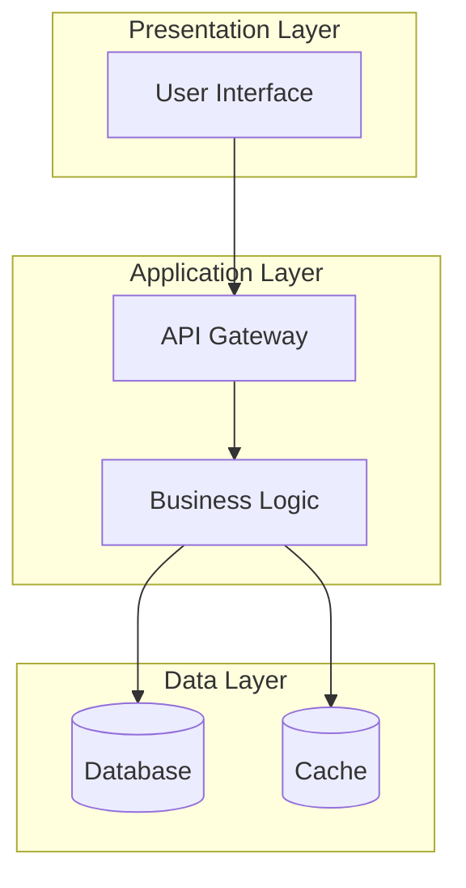
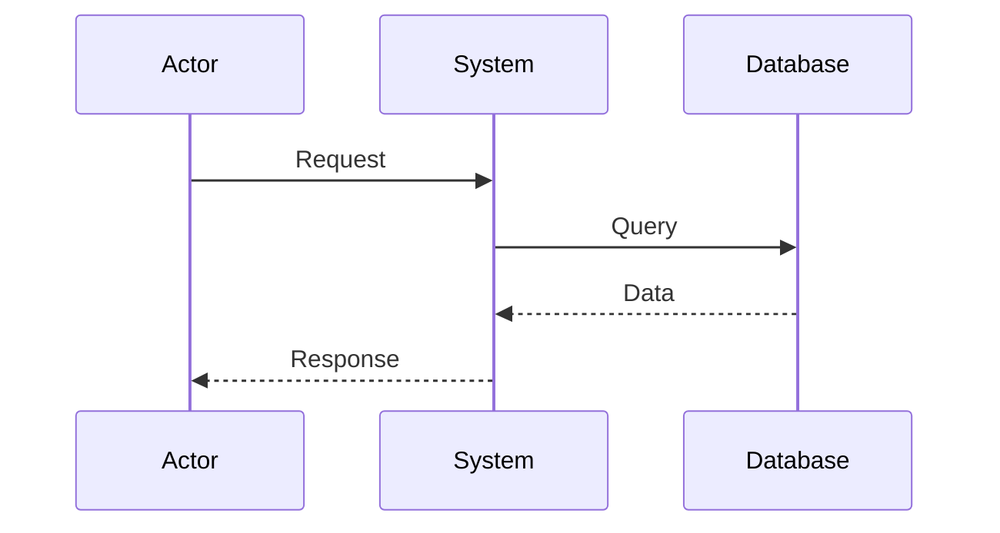
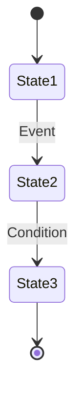
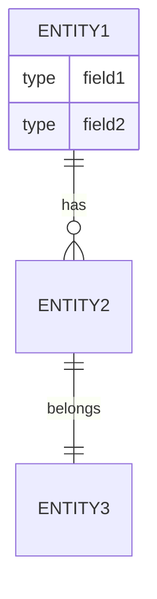
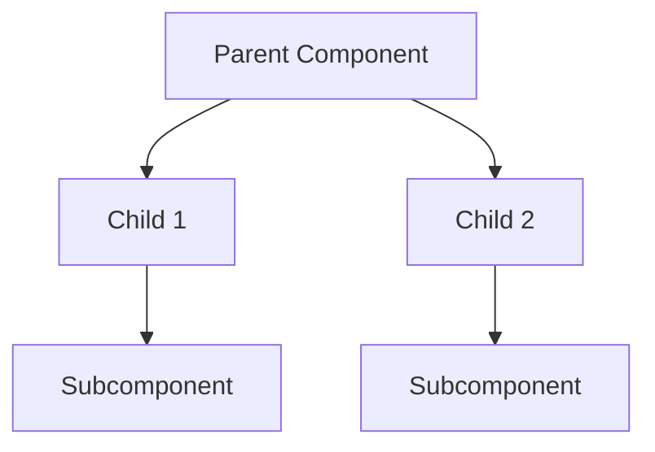
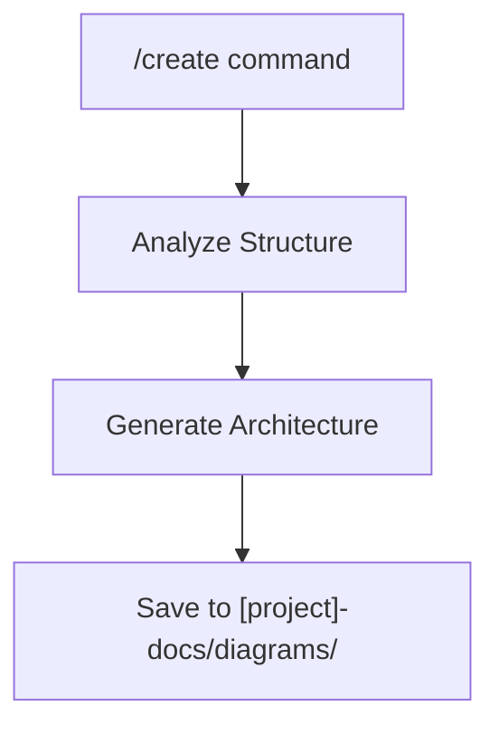
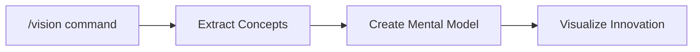
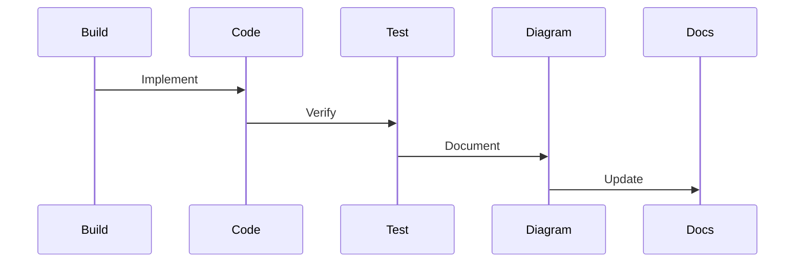

# Diagram Pattern Component

Reusable diagram patterns and templates for consistent visualization across all commands.

## Integration Instructions

Add this component to commands that need diagram generation capabilities:

```xml
<diagram_capability>
# Check if diagram generation is needed
Detect diagram-worthy patterns in:
- Architecture descriptions
- Component relationships
- Data flows
- Process workflows
- System interactions

# Generate contextual diagrams
When appropriate, create diagrams to visualize:
- Complex relationships
- Multi-step processes
- System architectures
- Data transformations
</diagram_capability>
```

## Core Diagram Patterns

### 1. Architecture Pattern


### 2. Flow Pattern


### 3. State Pattern


### 4. Entity Pattern


### 5. Component Pattern


## Dynamic Diagram Generation

### Context-Aware Templates
```javascript
// Pseudo-code for diagram selection
function selectDiagramType(context) {
    if (context.includes('architecture')) return 'graph TB'
    if (context.includes('flow') || context.includes('process')) return 'sequenceDiagram'
    if (context.includes('state') || context.includes('status')) return 'stateDiagram-v2'
    if (context.includes('entity') || context.includes('database')) return 'erDiagram'
    if (context.includes('class') || context.includes('inheritance')) return 'classDiagram'
    return 'graph LR' // default
}
```

### Style Tokens
```css
/* Consistent styling across diagrams */
:root {
    --primary-color: #3b82f6;
    --secondary-color: #8b5cf6;
    --success-color: #10b981;
    --warning-color: #f59e0b;
    --error-color: #ef4444;
    --neutral-color: #6b7280;
}
```

## Integration with Commands

### For /create Command


### For /vision Command


### For /build Command


## Diagram Metadata Format

```json
{
  "id": "diagram-[timestamp]",
  "type": "architecture|flow|state|entity|component",
  "title": "Diagram Title",
  "description": "What this diagram shows",
  "project": "project-name",
  "context": {
    "command": "source-command",
    "session": "session-id",
    "related": ["other-diagram-ids"]
  },
  "content": "mermaid diagram content",
  "created": "ISO timestamp",
  "updated": "ISO timestamp",
  "tags": ["architecture", "backend", "api"],
  "exports": {
    "svg": "path/to/export.svg",
    "png": "path/to/export.png"
  }
}
```

## Auto-Diagram Triggers

Commands should automatically suggest diagrams when detecting:

1. **Complexity Threshold**: More than 5 components interacting
2. **Relationship Density**: Multiple many-to-many relationships
3. **Process Steps**: Sequential operations with branches
4. **State Transitions**: Multiple states with conditions
5. **Architecture Description**: System-level explanations

## Usage Example

```xml
<!-- In any command -->
<diagram_integration>
  <use_component>@diagram-patterns</use_component>
  
  <auto_generate>
    When user describes system architecture:
    - Create architecture diagram
    - Save to project docs
    - Link in response
  </auto_generate>
  
  <enhance_output>
    Add diagrams to clarify:
    - Complex explanations
    - Multi-step processes
    - System relationships
  </enhance_output>
</diagram_integration>
```

## Best Practices

1. **Progressive Enhancement**: Start simple, add detail as needed
2. **Consistent Notation**: Use same symbols across diagrams
3. **Contextual Relevance**: Only create diagrams that add value
4. **Version Tracking**: Update diagrams with code changes
5. **Cross-Referencing**: Link related diagrams together