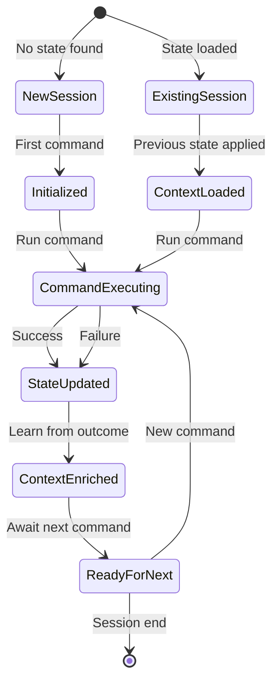

# Session State Management Component

Provides comprehensive session state tracking and management for all Claude Code commands, enabling context persistence, learning from past actions, and intelligent command chaining.

## Core State Structure

```json
{
  "session_id": "{{uuid}}",
  "created_at": "{{ISO_8601}}",
  "last_updated": "{{ISO_8601}}",
  "project_context": {
    "name": "{{project_name}}",
    "path": "{{absolute_path}}",
    "type": "{{monorepo|single|library}}",
    "stack": {
      "primary": "{{framework}}",
      "language": "{{language}}",
      "tools": ["{{tool1}}", "{{tool2}}"]
    }
  },
  "command_history": [
    {
      "command": "{{command_name}}",
      "timestamp": "{{ISO_8601}}",
      "input": "{{user_input}}",
      "thinking_depth": "{{basic|medium|deep}}",
      "outcome": "{{success|partial|failed}}",
      "key_decisions": ["{{decision1}}", "{{decision2}}"],
      "artifacts_created": ["{{file1}}", "{{file2}}"],
      "learnings": ["{{learning1}}", "{{learning2}}"]
    }
  ],
  "accumulated_context": {
    "decisions": {
      "architecture": ["{{decision1}}", "{{decision2}}"],
      "technology": ["{{choice1}}", "{{choice2}}"],
      "patterns": ["{{pattern1}}", "{{pattern2}}"]
    },
    "constraints": {
      "technical": ["{{constraint1}}", "{{constraint2}}"],
      "business": ["{{constraint1}}", "{{constraint2}}"],
      "timeline": "{{deadline_if_any}}"
    },
    "preferences": {
      "coding_style": "{{detected_style}}",
      "testing_approach": "{{detected_approach}}",
      "documentation_level": "{{minimal|standard|comprehensive}}"
    }
  },
  "verification_history": {
    "failures": [
      {
        "type": "{{test|build|lint}}",
        "description": "{{what_failed}}",
        "resolution": "{{how_resolved}}",
        "prevention": "{{future_prevention}}"
      }
    ],
    "assumptions_validated": {
      "{{assumption_key}}": {
        "assumed": "{{original_assumption}}",
        "actual": "{{reality}}",
        "impact": "{{low|medium|high}}"
      }
    }
  },
  "ai_state": {
    "confidence_trending": "{{increasing|stable|decreasing}}",
    "complexity_handled": "{{simple|moderate|complex}}",
    "user_satisfaction_signals": {
      "explicit_feedback": ["{{feedback1}}", "{{feedback2}}"],
      "implicit_signals": {
        "command_corrections": {{count}},
        "clarification_requests": {{count}},
        "successful_completions": {{count}}
      }
    }
  }
}
```

## State Persistence

### File Structure
```
.claude/session/
├── current/
│   ├── state.json           # Current session state
│   ├── command_history.md   # Human-readable history
│   └── findings/            # Command-specific outputs
│       ├── create.json
│       ├── vision.json
│       ├── build.json
│       └── ...
├── archive/
│   └── {{date}}/            # Past sessions
└── global/
    ├── patterns.json        # Learned patterns
    └── preferences.json     # User preferences
```

## State Operations

### Reading State
```xml
<read_session_state>
  <check_exists>
  if [[ -f ".claude/session/current/state.json" ]]; then
    STATE=$(cat .claude/session/current/state.json)
  else
    STATE="new_session"
  fi
  </check_exists>
  
  <parse_state>
  Extract relevant context:
  - Last command: {{last_command}}
  - Last outcome: {{outcome}}
  - Active decisions: {{decisions}}
  - Known constraints: {{constraints}}
  </parse_state>
  
  <apply_context>
  Use state to inform current command:
  - Reference previous decisions
  - Avoid repeated mistakes
  - Build on successes
  - Maintain consistency
  </apply_context>
</read_session_state>
```

### Writing State
```xml
<write_session_state>
  <update_structure>
  {
    "command": "{{current_command}}",
    "timestamp": "{{now}}",
    "changes": {
      "decisions_added": ["{{new_decision}}"],
      "files_created": ["{{new_files}}"],
      "patterns_detected": ["{{new_patterns}}"],
      "issues_encountered": ["{{new_issues}}"]
    }
  }
  </update_structure>
  
  <persist_changes>
  # Atomic write to prevent corruption
  echo "$NEW_STATE" > .claude/session/current/state.json.tmp
  mv .claude/session/current/state.json.tmp .claude/session/current/state.json
  </persist_changes>
  
  <update_history>
  # Append to command history
  echo "## {{command}} - {{timestamp}}" >> .claude/session/current/command_history.md
  echo "{{summary}}" >> .claude/session/current/command_history.md
  </update_history>
</write_session_state>
```

## Context Accumulation

### Decision Tracking
```xml
<decision_accumulation>
  <architectural_decisions>
  Track high-level choices:
  - Framework selection: {{framework}} because {{reason}}
  - Database choice: {{database}} because {{reason}}
  - Deployment target: {{platform}} because {{reason}}
  </architectural_decisions>
  
  <pattern_recognition>
  Identify recurring patterns:
  - User prefers: {{preference_pattern}}
  - Project follows: {{code_pattern}}
  - Common issues: {{issue_pattern}}
  </pattern_recognition>
  
  <constraint_learning>
  Understand limitations:
  - Technical: {{learned_constraints}}
  - Resource: {{identified_limits}}
  - Policy: {{discovered_rules}}
  </constraint_learning>
</decision_accumulation>
```

### Cross-Command Intelligence
```xml
<cross_command_context>
  <from_create>
  If /create was run:
  - Project structure: {{structure}}
  - Technology choices: {{stack}}
  - Initial patterns: {{patterns}}
  </from_create>
  
  <from_vision>
  If /vision was run:
  - Innovation ideas: {{concepts}}
  - User excitement: {{features}}
  - Future direction: {{vision}}
  </from_vision>
  
  <from_build>
  If /build was run:
  - What worked: {{successes}}
  - What failed: {{failures}}
  - Performance data: {{metrics}}
  </from_build>
  
  <apply_intelligence>
  Use accumulated knowledge:
  - Suggest next logical step
  - Avoid previous failures
  - Build on established patterns
  - Maintain consistency
  </apply_intelligence>
</cross_command_context>
```

## State Queries

### Common Queries
```javascript
// Pseudo-code for state queries
const stateQueries = {
  // What was the last successful build command?
  lastSuccessfulBuild: () => {
    return history.filter(cmd => 
      cmd.command === 'build' && 
      cmd.outcome === 'success'
    ).pop()
  },
  
  // What patterns have we established?
  establishedPatterns: () => {
    return accumulated_context.decisions.patterns
  },
  
  // What should we avoid?
  knownIssues: () => {
    return verification_history.failures.map(f => ({
      type: f.type,
      prevention: f.prevention
    }))
  },
  
  // What's our confidence level?
  currentConfidence: () => {
    const recent = history.slice(-5)
    const successRate = recent.filter(c => 
      c.outcome === 'success'
    ).length / recent.length
    return successRate > 0.8 ? 'high' : 
           successRate > 0.5 ? 'medium' : 'low'
  }
}
```

## User-Visible State Summary

```markdown
### 📊 Session Context

**Current Project**: {{project_name}}
**Session Duration**: {{duration}}
**Commands Run**: {{count}}

**Established Context**:
- Architecture: {{architecture_summary}}
- Key Decisions: {{decision_list}}
- Active Constraints: {{constraint_list}}

**Recent Activity**:
1. {{recent_command_1}} - {{outcome_1}}
2. {{recent_command_2}} - {{outcome_2}}
3. {{recent_command_3}} - {{outcome_3}}

**Confidence Level**: {{high|medium|low}}
- Based on: {{confidence_factors}}

{{#if relevant_learnings}}
**Applied Learnings**:
- {{learning_1}}: {{how_applied}}
- {{learning_2}}: {{how_applied}}
{{/if}}
```

## State Transitions

### Command State Flow


## Integration with Commands

### Command Integration Pattern
```xml
<command_state_integration>
  <!-- At command start -->
  <initialize>
    <load_state/>
    <apply_context/>
    <show_relevant_history/>
  </initialize>
  
  <!-- During execution -->
  <track>
    <record_decisions/>
    <note_assumptions/>
    <capture_outcomes/>
  </track>
  
  <!-- At command end -->
  <persist>
    <update_state/>
    <save_artifacts/>
    <extract_learnings/>
  </persist>
</command_state_integration>
```

## Privacy and Security

### Sensitive Data Handling
```xml
<privacy_protection>
  <excluded_from_state>
  Never store:
  - API keys or secrets
  - Passwords or credentials
  - Personal information
  - Proprietary code snippets
  </excluded_from_state>
  
  <sanitization>
  Before storing:
  - Replace secrets with placeholders
  - Hash sensitive identifiers
  - Truncate large outputs
  - Remove temporary paths
  </sanitization>
</privacy_protection>
```

## Best Practices

1. **Lightweight Storage**: Keep state focused and relevant
2. **Fast Access**: Optimize for quick reads during commands
3. **Atomic Updates**: Prevent corruption with safe writes
4. **Progressive Enhancement**: Work without state, enhance with it
5. **User Control**: Allow state reset and inspection
6. **Privacy First**: Never store sensitive information
7. **Intelligent Pruning**: Remove old irrelevant state
8. **Cross-Session Learning**: Build patterns over time

## Anti-Patterns

- ❌ Storing everything (state bloat)
- ❌ Blocking on state operations
- ❌ Losing state on errors
- ❌ Exposing internal state structure
- ❌ Making state required (should enhance, not depend)
- ❌ Storing sensitive information