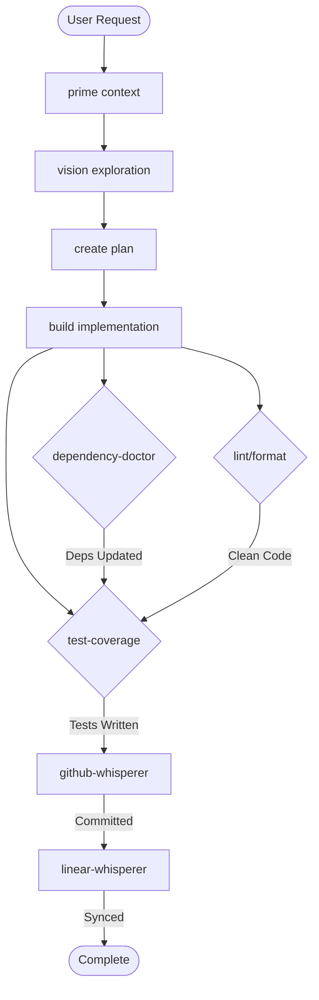
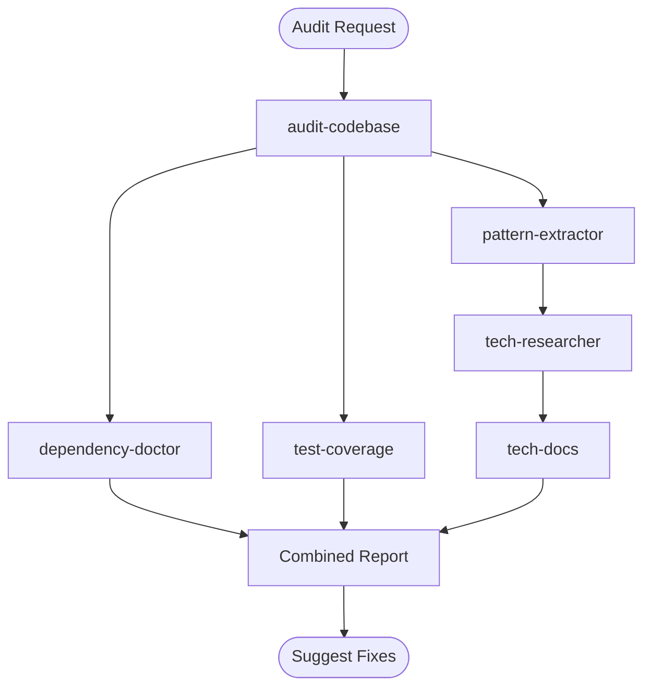
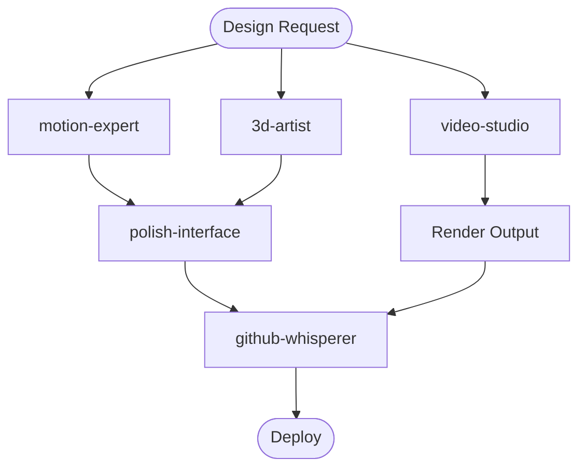

# 🔄 Agent Interaction Flowchart

Visual guide showing how halo agents hand off work to each other for seamless workflow automation.

## 🎯 Primary Workflows

### 🏗️ Development Flow


### 📊 Analysis Flow


### 🎨 Creative Flow


## 🔗 Agent Handoff Matrix

### Who Calls Whom

| From Agent | To Agent | When | Data Passed |
|------------|----------|------|-------------|
| **build** | test-coverage | After implementation | New files, changed files |
| **build** | dependency-doctor | Package changes detected | package.json changes |
| **build** | github-whisperer | Ready to commit | File list, commit message |
| **test-coverage** | github-whisperer | Tests added | Test files |
| **audit-codebase** | pattern-extractor | Patterns needed | Code locations |
| **audit-codebase** | simplify-design | Complexity found | Complex components |
| **github-whisperer** | linear-whisperer | After commit | Commit info, issue refs |
| **linear-whisperer** | github-whisperer | PR needed | Issue details |
| **tech-researcher** | tech-docs | Docs found | Documentation URLs |
| **github-analyzer** | pattern-extractor | GitHub repo analyzed | Key patterns found |
| **dependency-doctor** | test-coverage | After updates | Changed dependencies |
| **motion-expert** | polish-interface | Animation added | Component refs |
| **3d-artist** | motion-expert | 3D scene ready | Animation hooks |
| **video-studio** | github-whisperer | Video rendered | Output files |

## 🎮 Command-Agent Integration

### Commands That Trigger Agents

```yaml
command_triggers:
  /prime:
    triggers:
      - github-analyzer (if GitHub repo URL provided)
      - audit-codebase (if --audit flag)
  
  /create:
    triggers:
      - tech-researcher (for tech stack research)
      - pattern-extractor (for similar projects)
  
  /build:
    triggers:
      - test-coverage (if --test flag)
      - github-whisperer (if --commit flag)
      - linear-whisperer (if issue referenced)
  
  /vision:
    triggers:
      - motion-expert (for UI animations)
      - 3d-artist (for visual effects)
      - video-studio (for demos)
  
  /audit:
    always_triggers:
      - audit-codebase
      - dependency-doctor
      - test-coverage
  
  /docs:
    triggers:
      - tech-docs (for external docs)
      - docs-generator (for internal docs)
```

## 🔄 Workflow Patterns

### Sequential Pattern
```
User → Command → Agent1 → Agent2 → Agent3 → Result
```
Example: `/build auth` → build → test-coverage → github-whisperer → linear-whisperer

### Parallel Pattern
```
         ┌→ Agent1 →┐
Command →├→ Agent2 →├→ Aggregate → Result
         └→ Agent3 →┘
```
Example: `/audit` → {audit-codebase, dependency-doctor, test-coverage} → Report

### Conditional Pattern
```
Command → Agent1 → Decision → Agent2a OR Agent2b → Result
```
Example: build → test-coverage → (if failing) → debug-assistant OR github-whisperer

## 📊 Data Flow Standards

### Context Preservation
```typescript
interface AgentContext {
  // Preserved across handoffs
  session: {
    id: string;
    user: string;
    project: string;
  };
  
  // Added by each agent
  breadcrumbs: Array<{
    agent: string;
    timestamp: string;
    action: string;
  }>;
  
  // Accumulated data
  artifacts: {
    files: string[];
    reports: Report[];
    metrics: Metrics;
  };
}
```

### Handoff Protocol
```yaml
handoff_protocol:
  1_prepare:
    - Summarize work done
    - Package relevant data
    - Clear next actions
  
  2_transfer:
    - Include session context
    - Pass specific data
    - Set expectations
  
  3_receive:
    - Acknowledge receipt
    - Validate data
    - Continue work
```

## 🚦 Decision Points

### When to Hand Off

```typescript
function shouldHandOff(currentAgent: Agent, situation: Situation): HandoffDecision {
  // Automatic handoffs
  if (situation.includes('need_tests') && currentAgent !== 'test-coverage') {
    return { to: 'test-coverage', priority: 'high' };
  }
  
  if (situation.includes('ready_to_commit') && currentAgent !== 'github-whisperer') {
    return { to: 'github-whisperer', priority: 'medium' };
  }
  
  if (situation.includes('complex_research') && currentAgent !== 'tech-researcher') {
    return { to: 'tech-researcher', priority: 'low' };
  }
  
  return { to: null, continue: true };
}
```

## 🎯 Optimization Strategies

### Minimize Handoffs
- Agents should complete related tasks before handoff
- Batch similar operations together
- Avoid ping-pong between agents

### Parallel Execution
When possible, run independent agents simultaneously:
```yaml
parallel_opportunities:
  after_build:
    - test-coverage
    - lint-check
    - bundle-analysis
  
  during_audit:
    - code-quality
    - dependency-health  
    - security-scan
```

### Smart Routing
```typescript
// Route based on expertise
const expertiseMap = {
  'animation': ['motion-expert', 'polish-interface'],
  '3d': ['3d-artist', 'video-studio'],
  'testing': ['test-coverage'],
  'git': ['github-whisperer'],
  'github': ['github-analyzer'],
  'dependencies': ['dependency-doctor'],
  'documentation': ['tech-docs', 'docs-generator']
};
```

## 📈 Performance Metrics

### Measure Success
```yaml
workflow_metrics:
  handoff_time: < 2s
  data_preservation: 100%
  context_clarity: High
  completion_rate: > 95%
  error_handling: Graceful
```

### Common Issues & Solutions

| Issue | Symptom | Solution |
|-------|---------|----------|
| Lost Context | Agent doesn't understand task | Include full context in handoff |
| Duplicate Work | Agents repeat actions | Check breadcrumbs before acting |
| Infinite Loop | A→B→A→B... | Add loop detection |
| Data Mismatch | Unexpected data format | Validate inputs strictly |

## 🔮 Future Enhancements

### Planned Improvements
- Visual workflow designer
- Real-time agent status dashboard
- Automatic workflow optimization
- Agent performance profiling
- Multi-agent orchestration

### Advanced Patterns
- Recursive agent calls for complex tasks
- Dynamic agent team assembly
- Learning optimal handoff patterns
- Predictive next-agent suggestions

---

*This flowchart is a living document. Update it as new interaction patterns emerge.*